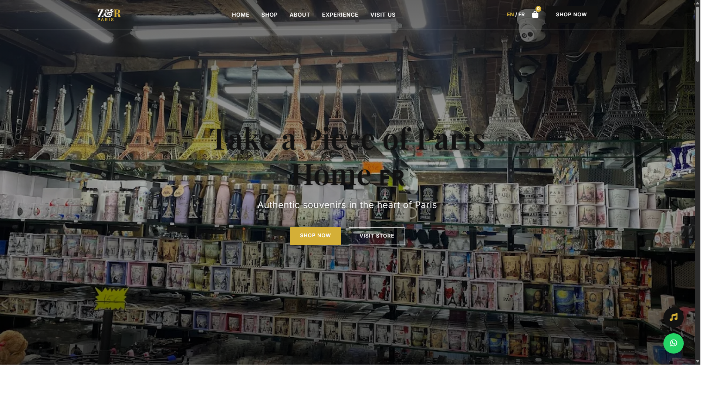
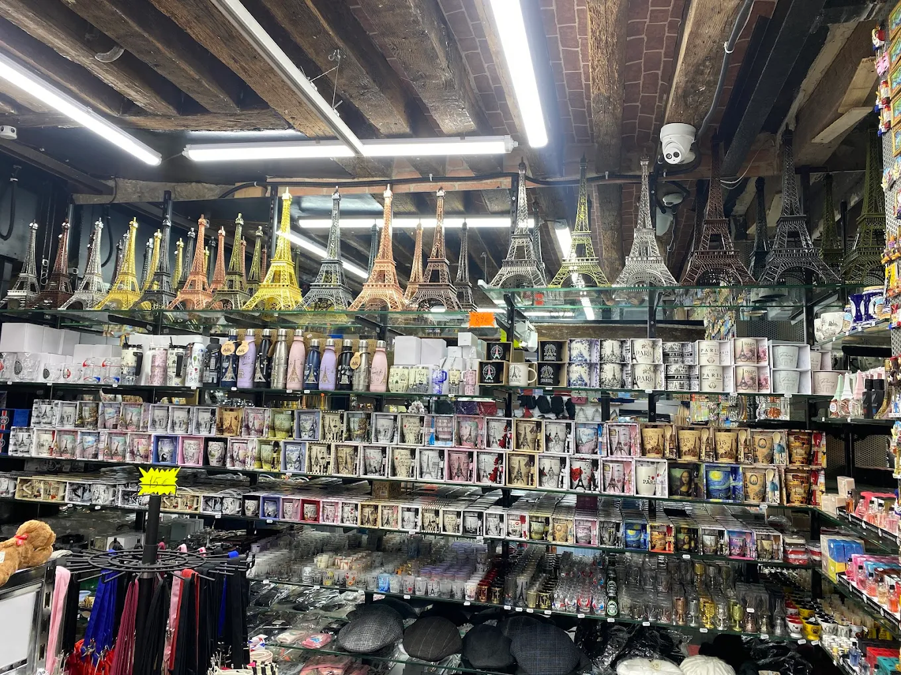
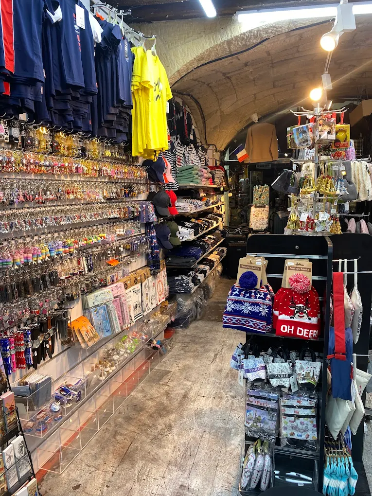
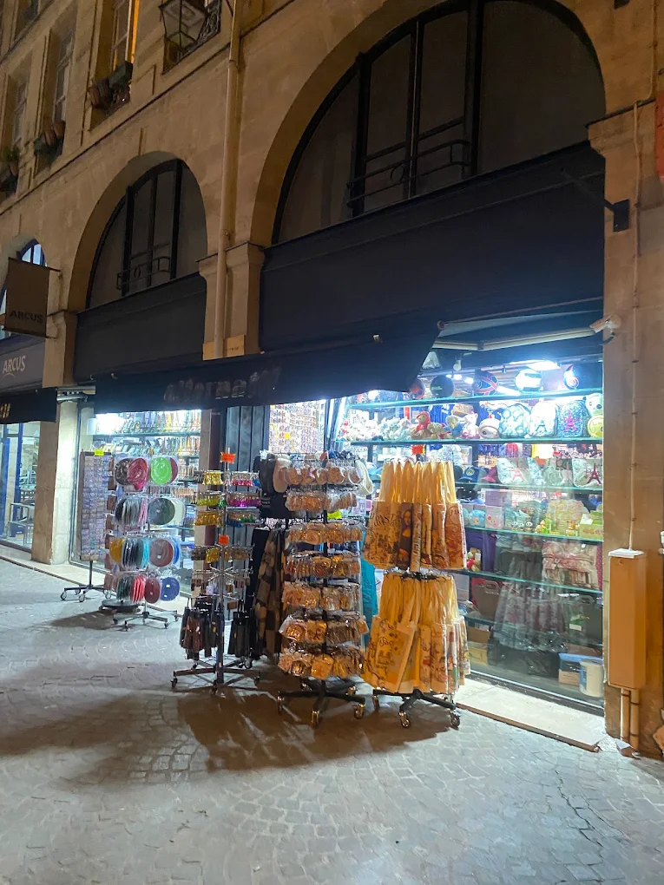

# Z&R Paris Souvenir 🇫🇷

Welcome to the **Z&R Paris Souvenir** website repository! This is a modern, elegant web application designed to showcase authentic Parisian keepsakes, gifts, and souvenirs in the heart of Paris. The site highlights the beauty of Paris and provides an immersive browsing experience for visitors.

## 📸 Sneak Peek

Here is a full preview of the website's design and then some glimpses of the aesthetics we offer:

### Full Website Preview


### The Vibe


### Inside the Store


### Our Curated Collection


## ✨ Features

- **Bilingual Interface**: Seamlessly switch between English and French with a built-in language toggle.
- **Interactive Shopping Cart**: Add souvenirs to your cart and watch it update dynamically.
- **Immersive Audio**: Toggle Parisian cafe background music to enhance the browsing experience.
- **Rich Aesthetics**: Premium design featuring smooth animations, elegant fonts (Inter & Playfair Display), and a cohesive color palette.
- **Responsive Layout**: Optimized to look great on desktop, tablet, and mobile devices.

## 🛠️ Built With

- **HTML5**: Semantic web structure.
- **CSS3 (Vanilla)**: For styling, flexbox/grid layouts, responsiveness, and polished interactive animations.
- **JavaScript**: For cart logic, bilingual content switching, and audio controls.

## 🚀 Getting Started

Simply clone this repository and open `index.html` in your favorite web browser. No complex build tools or servers required!

```bash
git clone https://github.com/DivyamTheDev/ZR-souvenir.git
```
